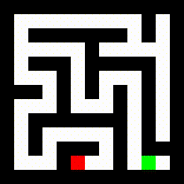
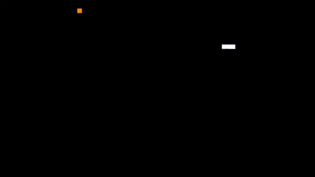

### TLDR:
- Used PPO to train an agent to solve small and fully observable maze at test time
- Implemented my own vectorized environement in cython and made it generates a new maze at each reset in order to force the agent to generalize
- Following the idea of curriculum training I gradually increased the distance between the start and the exit during training

---

  

### Motivation

Following my first semester at [master IASD](https://www.masteriasd.eu/en/) I felt like my course in RL was too theoretical hence I took the goal to implement some policy gradient algorithm like REINFORCE, A2C and PPO during the christmas holidays. 

Initially I implemented a small grid world in a custom gym environment where you would design the grid yourself by placing the agent starting position, the walls and the rewards. However I found that the task was made either trivial or almost impossible depending on the grid design. I also disliked the idea that the agent was not really reasoning but was merely overfitting to a particular grid design. To solve that last problem I would have need to generate a lot of new grids which I could not therefore I set out to solve small maze as they can be efficiently generated.

### Environment description :

Each maze possess 4 types of cells: 
- Blanks
- Walls
- The agent
- The exit

At each step the agent is given the full maze as observation.

The rewards are : 
- +1 on reaching the exit
- -0.001 on bumping into a wall 
- -0.001 at each step to encourage efficient path
They are very sparse and this made training very difficult. This is deliberate as I wanted the agent to learn its own set of heuristics. However it made training much more tedious than what it could have been. 

To generate the labyrinths I employed the depth-first search algorithm which you can see in action below :

  

The starting position is placed randomly and the exit is located at a fixed distance from the start. The distance between exit and start can be controlled to manipulate the difficulty of the maze which is what I will be doing during training.

To generate the environment I started with gymnasium and used its vectorized utilities. However I realized that speed was going to be an issue during training so I stepped out of gymnasium entirely and implemented everything in cython including the handling of vectorized environments. 

### Training algorithm :

I used PPO which I implemented in pytorch inspiring myself from  Clean RL's [implementation](https://github.com/vwxyzjn/cleanrl/blob/master/cleanrl/ppo.py). Handling the mask logic in GAE as well as the reset of vectorized environments was quite tricky and not something I'd like to redo during holidays but alas it is done now and the agent is learning. 

During training I kept track of the average length needed for the agent to reach the exit. If it was close to perfect I incremented the distance between exit and start. This helped alleviate the sparsity of the rewards.

